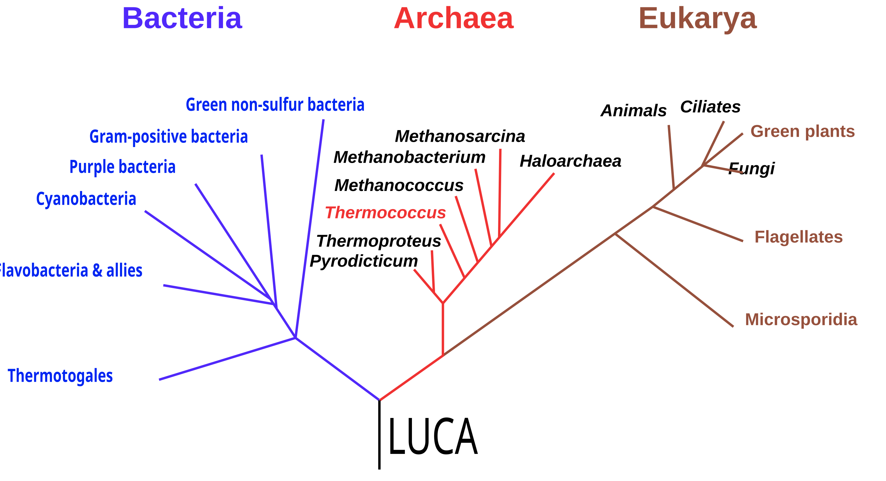

# luca-blueprint

> **The living DNA of multi-agent systems** – reproducible, evolvable, signed, and shareable.

---

## Table of Contents
1. [Motivation](#motivation)  
2. [Key Concepts](#key-concepts)  
3. [Features at a Glance](#features-at-a-glance)  
4. [Biological Analogy Cheat Sheet](#biological-analogy-cheat-sheet)  
5. [Architecture Overview](#architecture-overview)  
6. [The Genetic Code Spec](#the-genetic-code-spec)  
7. [Epigenetic Layer](#epigenetic-layer)  
8. [Installation & Quick-Start](#installation--quick-start)  
9. [CLI / Python API](#cli--python-api)  
10. [Memory Back-Ends](#memory-back-ends)  
11. [IPFS + IPLD + Signing](#ipfs--ipld--signing)  
12. [Versioning & Genealogy](#versioning--genealogy)  
13. [Examples & Tutorials](#examples--tutorials)  
14. [Performance & Benchmarks](#performance--benchmarks)  
15. [Security Considerations](#security-considerations)  
16. [Roadmap](#roadmap)  
17. [Contributing](#contributing)  
18. [License](#license)  

---

## Motivation

There are too many orchestration tools, agents, recipes, scripts, hacks for the modern agentic development(agent-dev?) world. You must crawl 30 tweet long threads, reddit, try things on your own and frankstein the steps into your python/javascript/etc jerry-rigged codebase. It's not reproducible and worse there's no way to easily share them, keep track of them, version them, see what worked best/rollback/branch etc. What if there was a better way?

## Requirements

- Reproducibility - The blueprint should have everything it needs to run, aka it should be completely self describing and as long as it's put into another "cellular nucleus" it should be able to run. In other words in the future an LLM should be able to read the Luca-Blueprint and launch everything it needs. 
- Proof of Provenance - You should know the entire chain of branches of how this blueprint came to be. 
- Recombination - You should be able to "hybridize" blueprints aka mix 2 or n different blueprints to try out different evolutionary strategies. Children of the same parent blueprints can look different and that's the idea.

## Solution 

The name is a play on [LUCA](https://en.wikipedia.org/wiki/Last_universal_common_ancestor), the last universal common ancestor from which all life diverged. 

Our DNA is shared across the planet reaching back to this archaic form of life after billions of years of genetic evolution, recombination, and untold dead ends. This blueprint is 

---

## Assumptions

It's naive to think orchestration will remain static, even possibly within the same agentic session. In one moment a critic-generator-discriminator may make sense and in another it may require a commitee (different areas of the "genome" are read). Additionally during the very same process it is being called, it can update its own orchestration calls if it sees there is a better way of doing things. It provides intent not deterministic outcomes (these can be RL'd of course)

Much like genes its lossy/some fidelity loss during transcription/translation as LLMs can be constrained but won't be entirely deterministic. The goal is to reduce the "misfolded" proteins and ensure the system is self healing.

De novo mutations in each generation optionally (can increase the "fuzz" - stochastic temp per generation) which is adaptive/useful to get out of genetic local minima. 


## Key Concepts

| Concept | README Shorthand | One-Liner |
|---------|------------------|-----------|
| **Genetic Code** | `blueprint.json` | Canonical, signed, content-addressed definition of the orchestration DAG/graph. |
| **Epigenetics** | `config.{env}.yml` | Context-specific overrides (thresholds, scaling rules, A/B flags). |
| **Ribosomes** | Ochestration Tool (CrewAI? Autogen?)
| **Proteins** | _Agents/Nodes_ | Containerized components (LLMs, API wrappers, data fetchers, critics, generators, etc.). |
| **Recombination & Mutation** | GA loop | Operator that breeds, mutates, and re-evaluates blueprints to search better variants. |
| **Genealogy** | [IPLD](https://dasl.ing/) links | Directed graph of all parents ↔ children plus metadata & fitness scores. |

---

## Features at a Glance
- **Single-file “DNA”** → portable, shareable, self-describing JSON + optional Frictionless metadata.  
- **LLM-native execution** → GPT-class models can parse & run the blueprint via tool calling.  
- **Epigenetic overrides** → adjust behaviour per environment without touching the core genome.  
- **Genetic optimisation loop** → built-in GA engine for crossover, mutation, selection.  
- **Pluggable memories** → vector DBs (Qdrant, Milvus), knowledge graphs, SQL/NoSQL, Elasticsearch.  
- **Content-addressed & verifiable** → stored on IPFS, linked with IPLD, signed with ED25519.  
- **Zero-to-run** with **uv** → one `uv sync` auto-installs all declared deps.  
- **Compatible** with LangGraph, CrewAI, AutoGen, n8n-style node execution.

---

## Biological Analogy Cheat Sheet

| Biology | luca-blueprint |
|---------|----------------|
| DNA double helix | `blueprint.json` schema |
| Genes & alleles | Agent/task blocks & parameter sets |
| mRNA transcription | LLM/tool parsing stage |
| Ribosome translation | Runtime that spins up Docker/venv, executes tasks |
| Proteins | Live agents & services |
| Epigenetic tags (methylation) | `config.*.yml`, env vars, policy rules |
| Mutation / crossover | GA operator that rewrites JSON |
| Natural selection | Fitness evaluation & scoring pipeline |
| Horizontal gene transfer | Importing successful blueprint chunks from other repos |

---

## Architecture Overview

```text
              ┌────────────┐          ┌───────────────┐
              │ blueprint  │  parse   │  Runtime      │
User → LLM ─► │  (JSON)    ├─────────►│  (CrewAI,     │
              └────────────┘          │   LangGraph…) │
                     ▲                └──────┬────────┘
                     │ GA mutate/cross       │ exec
              ┌──────┴───────┐         ┌─────▼──────┐
              │ Genealogy DB │◄────────┤ Agents /   │
              │ (IPLD links) │  store  │ Containers │
              └──────────────┘         └────────────┘
```

## The Genetic Code Spec

Schema (v0.1)
```json
{
  "$schema": "https://luca.dev/schemas/blueprint-0.1.json",
  "meta": {
    "id": "did:ipld:Qm...",
    "title": "news-summariser-v3",
    "version": "0.1.7",
    "authors": ["@alice", "@bob"],
    "created": "2025-06-26T15:04:00Z",
    "signature": "ed25519:..."
  },

  "environment": {
    "python": "3.12",
    "uv": {
      "requirements": ["langgraph>=0.5.2", "qdrant-client==1.*", "openai"]
    },
    "docker": [
      { "image": "luca/agent-runner:1.2.0", "with": ["–gpu"] }
    ]
  },

  "agents": [
    {
      "id": "llm_main",
      "type": "openai",
      "model": "gpt-4o-mini",
      "prompt_template": "./prompts/summarise.jinja",
      "tools": ["web-search", "code-exec"],
      "memory": "vectordb_primary"
    },
    {
      "id": "critic",
      "type": "openai",
      "model": "gpt-4o-mini",
      "role": "quality_checker"
    }
  ],

  "tasks": [
    { "id": "fetch",   "agent": "llm_main", "action": "tool:web-search", "args": { "query": "{{input}}" } },
    { "id": "draft",   "agent": "llm_main", "after": ["fetch"], "output": "draft.txt" },
    { "id": "review",  "agent": "critic",   "after": ["draft"], "criteria": ["len<300"], "output": "review.txt" }
  ],

  "workflow": {
    "edges": [
      ["fetch","draft"],
      ["draft","review"]
    ],
    "fitness_metric": "rouge-L"
  },

  "memory": {
    "vectordb_primary": {
      "kind": "qdrant",
      "url": "http://localhost:6333",
      "collection": "news-chunks",
      "embedder": "openai/text-embedding-3-small"
    }
  }
}
```

Full JSON Schema lives in /schema/blueprint-0.1.schema.json.

### Prompts

Recommended places to store / reference prompt templates
| Use-case                                              | Where to put the template                                                                     | How agents point to it                           | Pros                                                                                                | Cons                                                    |
| ----------------------------------------------------- | --------------------------------------------------------------------------------------------- | ------------------------------------------------ | --------------------------------------------------------------------------------------------------- | ------------------------------------------------------- |
| **Small, single-use prompt**                          | Inline in the **agent** block (`prompt` field)                                                | `"prompt": "You are a polite JSON validator …"`  | • Self-contained<br>• Easiest to copy-paste                                                         | • Bulks up the JSON<br>• Harder to diff across versions |
| **Reusable prompt shared by many agents**             | Top-level **`prompts`** section; each entry has an `id` and `content`                         | `"prompt_id": "summarise_v1"`                    | • DRY; one canonical copy<br>• Easy GA mutations (swap IDs)<br>• Version prompts separately         | • Extra dereference step at runtime                     |
| **Large or formatted prompt (Jinja, Markdown, etc.)** | External file in `/prompts/…` folder or separate CID; agent stores a **relative path or CID** | `"prompt_template": "./prompts/summarise.jinja"` | • Keeps blueprint tidy<br>• Syntax-highlighting in IDEs<br>• Can pin file on IPFS & sign separately | • Need to bundle or fetch file when executing           |

1 · Inline prompt (quick prototypes)
```{
  "agents": [
    {
      "id": "llm_inline",
      "type": "openai",
      "model": "gpt-4o-mini",
      "prompt": "You are an expert proof-reader. Rewrite {{text}} with perfect grammar.",
      "tools": []
    }
  ]
}
```
2 · Central prompts registry (recommended for most projects)
```{
  "prompts": {
    "summarise_v1": {
      "format": "jinja2",
      "content": "Write a concise summary of the following article:\n\n{{article}}\n\n-- END --"
    },
    "critic_v1": {
      "format": "jinja2",
      "content": ""
    }
  },

  "agents": [
    {
      "id": "llm_main",
      "type": "openai",
      "model": "gpt-4o-mini",
      "prompt_id": "summarise_v1",
      "tools": ["web-search"]
    },
    {
      "id": "critic",
      "type": "openai",
      "model": "gpt-4o-mini",
      "prompt_id": "critic_v1"
    }
  ]
}
```
GA mutation tip:
Your genetic operator can swap prompt_ids or splice new ones into the prompts map while leaving the rest of the genome unchanged.

3 · External template (best for large / multi-file prompts)
```
{
  "agents": [
    {
      "id": "llm_main",
      "type": "openai",
      "model": "gpt-4o-mini",
      "prompt_template": "./prompts/summarise.jinja"
    }
  ]
}
```
When you sign & push, include the prompts/ directory in the CAR file or upload each template to IPFS and reference its CID:
```
"prompt_cid": "bafybeigd.../summarise.jinja"
```


## Epigenetic Layer

```yaml
# config.prod.yml
runtime:
  max_parallel_tasks: 8
  switch_model_if_latency_ms_gt: 3000
memory:
  vectordb_primary:
    url: "http://qdrant.prod.internal:6333"
```
Parsed before execution; never changes core genome.

### Epigenetic overrides for prompts
Need to A/B a new prompt without touching the core genome?

```yaml
# config.abtest.yml
prompts:
  critic_v1:
    content: "Provide STRICTLY bullet-point feedback on {{text}}."
```
At runtime `luca run --config config.abtest.yml` … will shadow the original critic_v1 prompt for that environment only.

**Summary checklist**
- Prototype fast? → inline prompt in the agent.
- Multiple agents share? → top-level prompts map + prompt_id references.
- Big / complex prompt? → external file path or IPFS CID via prompt_template / prompt_cid.
- Need environment-specific tweaks? → override in config.*.yml (epigenetics).


## Installation & Quick-Start
```bash
# 1. Clone & pin submodules
git clone https://github.com/your-org/luca-blueprint.git
cd luca-blueprint

# 2. Install uv if missing
pip install uv

# 3. Sync declared deps (auto-creates .venv)
uv sync

# 4. Launch first run (uses sample blueprint + GA optimiser)
python -m luca run examples/news-summariser/blueprint.json
```
Docker is optional but recommended; see /docs/docker.md.

## CLI / Python API

| Command                 | Purpose                                                             |
| ----------------------- | ------------------------------------------------------------------- |
| `luca run <blueprint>`  | Parse blueprint (JSON/URL/IPFS hash) and execute graph.             |
| `luca ga <blueprint>`   | Spawn genetic optimiser, write new children under `/data/lineage/`. |
| `luca sign <blueprint>` | Sign with your DID key & upload to IPFS.                            |
| `luca viz <blueprint>`  | Render Mermaid or Cytoscape diagram of DAG/graph.                   |

## Memory Back-Ends

- Vector DBs: Qdrant (default), Milvus, LanceDB
- Knowledge Graphs: Neo4j, Kùzu (WASM)
- SQL/NoSQL: Postgres, SQLite, DuckDB
- Elasticsearch / OpenSearch for keyword + BM25
See docs/memory.md.

## IPFS + IPLD + Signing
1. `luca sign` → ED25519 signature in `meta.signature`.
2. `luca push` → publishes CAR to IPFS.
3. Parents/children stored as IPLD links under /meta/parents.
4. `luca verify <cid>` checks tamper-proofness.

## Versioning & Genealogy
```javascript
QmParent ⟶ QmChild1
          ⟶ QmChild2 (best_fitness=0.91) ⟶ QmGrandChild1
```
- `.fitness.json` artefacts written on each run.
- `luca lineage --tree <cid>` explores ancestry.
- Pluggable scoring adapters (Rouge, BLEU, custom).

## Examples & Tutorials

| Path                        | Description                                     |
| --------------------------- | ----------------------------------------------- |
| `examples/news-summariser/` | Minimal LLM + critic with Qdrant memory.        |
| `examples/qa-bot/`          | LangGraph + epigenetic configs for dev/ci/prod. |
| `examples/hybrid-search/`   | Multi-DB memory with re-ranking.                |

Interactive Colab coming soon.

## Performance & Benchmarks
- Harness in `/benchmarks/`; run `pytest -m benchmark`.
- AI SLOP HERE ~~GA optimiser yields 34 % ROUGE-L uplift vs baseline after 25 generations (/reports/ga-uplift-v0.1.md).~~

## Security Considerations
- Deterministic containers for untrusted code.
- Signature verification mandatory unless --unsafe.
- Sandboxed tool calls by default; override with `--allow-shell`.

## Roadmap
- Schema v0.2: streaming edges & dynamic fan-out
- Web UI for lineage browsing
- Native WASM runtime (no Docker, if it doesn't run in the browser it's not real)
See ROADMAP.md.

## Contributing
PRs welcome! See CONTRIBUTING.md for code style and how to add new protein (agent) types or memory adapters.

## License
Apache 2.0 – see LICENSE.
